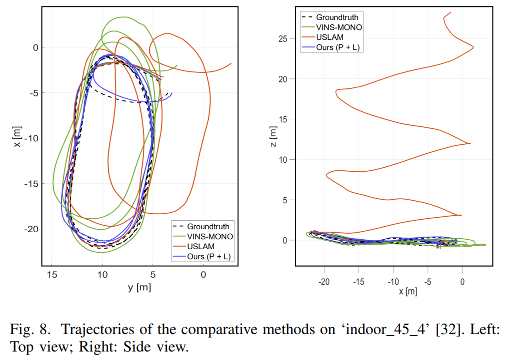

# Event-Frame-Inertial Odometry Using Point and Line Features Based on Coarse-to-Fine Motion Compensation (C2F-EFIO)

**Authors : Byeongpil Choi, Hanyeol Lee, and [Chan Gook Park](https://scholar.google.com/citations?user=9gwkQ7AAAAAJ&hl=en)**

### 1. Overview

This repository contains the ROS package for **Event-Frame-Inertial Odometry Using Point and Line Features Based on Coarse-to-Fine Motion Compensation (C2F-EFIO)**, written in **C++**. [[Paper]](https://ieeexplore.ieee.org/abstract/document/10855459)


### 2. Build

* This package was tested on **Ubuntu 16.04 (ROS Kinetic)** with **C++11**.
* Dependencies: 
   - Eigen 3.3.7
   - OpenCV 3.3.1
   - Boost 1.58.0.1
* No additional dependencies are required, and we expect this package to build without issues in other environments.
* The package uses the **catkin** build system:

```
cd catkin_ws
catkin_make
```

* Expected directory structure:

```
catkin_ws
│   src
│     ├── config
│     ├── dvs_msgs
│     ├── mono_tracker
│     ├── msckf_estimator
│     └── rviz
│   build
│   devel
│   dataset
│     ├── ECDS
│     │   ├── boxes_6dof.bag
│     │   ├── ...
│     │   ├── shapes_translation.bag 
│     └── droneracing
│         ├── indoor_45_2_davis_with_gt.bag
│         ├── ...
│         ├── indoor_forward_10_davis_with_gt.bag 
```


### 3. Run

* Prepare the visual-inertial calibration file in the `config/` folder and set the appropriate ROS topics in `msckf_estimator/launch/`.

- Launch files:
  - `msckf_estimator/smsckf_nesl_ECDS.launch`: Event-Camera Dataset
  - `msckf_estimator/smsckf_nesl_droneracing_IF.launch`: UZH-FPV Drone Racing Indoor Forward Dataset
  - `msckf_estimator/smsckf_nesl_droneracing_I45.launch`: UZH-FPV Drone Racing Indoor 45-Degree Dataset
  - `msckf_estimator/smsckf_nesl_rviz.launch`: RViz Launch

  Parameters setting in .launch files:

  ```
  max_cnt: The maximum number of point features to be tracked
  max_events: The number of events used to create the initial event frame (adaptively adjusted during runtime)
  life_pixel: The number of pixels a feature is allowed to move between consecutive event frames to calculate the lifetime of event point features
  eta: A ratio factor used to determine the optimal window size for extracting event lines
  pix_th: A threshold for selecting informative event points
  ransac_iter: The maximum number of iterations for RANSAC-based line fitting
  dist_thr: The distance threshold used for line outlier rejection tests
  theta_thr: The angle threshold used for line outlier rejection tests
  ```


* Launch the launch files

  ```
  roslaunch smsckf_nesl smsckf_nesl_ECDS.launch --screen
  roslaunch smsckf_nesl smsckf_nesl_rviz.launch
  rosbag play /root/catkin_ws/dataset/ECDS/boxes_6dof.bag       # prepared dataset
  ```

* Save the results

  ```
  rosbag record /smsckf_nesl/odom : img-synced output
  ```


### 4. Results

* Line detection  
<div align="center">
  
</div>

* Pose estimation  
<div align="center">
  
</div>

* Video demo  
<div align="center">
  
</div>


### 5. Citation

If you feel this work helpful to your academic research, we kindly ask you to cite our paper :

```
@article{C2F-EFIO_RAL,
  title={Event-Frame-Inertial Odometry Using Point and Line Features Based on Coarse-to-Fine Motion Compensation},
  author={Choi, Byeongpil and Lee, Hanyeol and Park, Chan Gook},
  journal={IEEE Robotics and Automation Letters},
  year={2025},
  publisher={IEEE}
}
```


### 6. Acknowledgements

This research was supported by the National Research Foundation of Korea (NRF), funded by the Ministry of Science and ICT, the Republic of Korea. (NRF-2022R1A2C2012166)


### 7. License

Our source code is released under MIT license. If you encounter any issues or have questions, please contact the author at bpc1224@snu.ac.kr.
